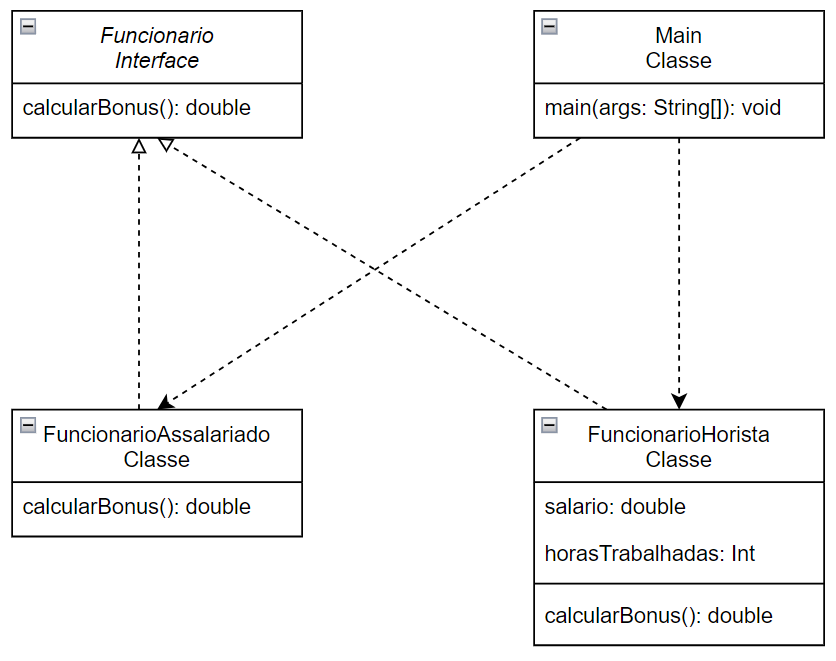

# INTERFACE
Este software é um sistema simples de gestão de funcionários que calcula o bônus anual de diferentes categorias de colaboradores. Ele suporta dois tipos de funcionários:

- Funcionário Assalariado: Recebe um bônus fixo de R$ 5.000,00.
- Funcionário Horista: Recebe um bônus equivalente a 10% do total anual recebido com base nas horas trabalhadas.

### Diagrama
- 

### 📋 Pré-requisitos
- JAVA 22.0.2
- [Download do JAVA](https://www.oracle.com/java/technologies/javase/22-0-2-relnotes.html)

### 🔧 Instalação
O projeto ainda não foi compilado, a unica for de usar é utilizando uma IDE que aceite o java.
Apenas iniciar /bin/app/Main.java.

### 🛠️ Construído com
- IDE Eclipse

### 📌 Versão
- Versão 1.0.

### ✒️ Autores
- Carlos H. Pirico - INTERFACE
